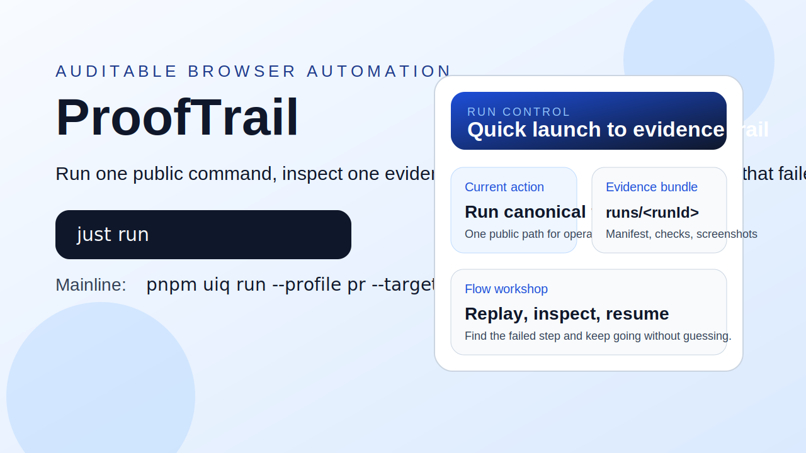

# ProofTrail

ProofTrail is an auditable browser automation platform for teams that need
repeatable runs, inspectable evidence, and a recoverable path when workflows
break.

[Docs](docs/index.md) | [Quickstart](docs/getting-started/human-first-10-min.md) | [Minimal Success Case](docs/showcase/minimal-success-case.md) | [Release Guide](docs/release/README.md)



> ProofTrail is for people who want browser automation to feel like an
> inspectable product workflow, not a pile of one-off scripts that become
> impossible to debug a week later.

## What This Repo Actually Does

How do we make browser automation reproducible, inspectable, and recoverable?

ProofTrail gives you one public mainline for running a workflow, one evidence
bundle for understanding what happened, and one shared repo for the backend,
web command center, automation runner, and MCP adapter that support that flow.

The canonical public mainline is:

1. run `just setup`
2. run `just run`
3. inspect `.runtime-cache/artifacts/runs/<runId>/`

`just run` is the canonical public mainline wrapper for `pnpm uiq run --profile pr --target web.local`.

`just run-legacy` remains available for lower-level workshop troubleshooting,
but it is not the canonical public mainline.

## Why Teams Use It

- **Fewer mystery failures**: every canonical run writes a manifest-first
  evidence bundle instead of leaving you with scattered logs and screenshots.
- **Easier recovery**: the web command center, run records, and flow workshop
  are built to help you inspect, replay, and repair workflows after something
  breaks.
- **One repo, one story**: backend orchestration, operator UI, automation
  runner, and release proof surfaces live together, so docs and runtime truth
  can stay aligned.

## Quickstart

Requirements:

- Python 3.11+
- Node.js 20+
- `pnpm`
- `uv`
- `just`

1. Install dependencies and local tooling.

```bash
just setup
```

2. Run the canonical workflow.

```bash
just run
```

3. Inspect the resulting evidence bundle.

```bash
ls .runtime-cache/artifacts/runs
```

What good looks like:

- a new run directory appears under `.runtime-cache/artifacts/runs/<runId>/`
- the run contains `manifest.json` and report files you can review
- the same orchestrator-first chain is reachable through `pnpm uiq run --profile pr --target web.local`
- even when the PR gate fails, `reports/summary.json` still tells you why
  instead of leaving you with a silent shell failure

If `just run` fails, start with the
[human-first 10 minute guide](docs/getting-started/human-first-10-min.md) and
the [run evidence example](docs/reference/run-evidence-example.md) before
dropping to legacy helper paths.

## Suitable / Not Suitable

Suitable for:

- teams standardizing browser automation runs across operators and environments
- maintainers who need inspectable evidence instead of ad-hoc shell output
- workflows where replay, diagnostics, and recovery matter as much as first-run success

Not suitable for:

- tiny one-off browser scripts where no shared evidence or recovery path is needed
- teams unwilling to maintain a Python + Node workspace
- people looking for a hosted SaaS with zero local setup

## Validation and Governance

ProofTrail keeps the public story honest by separating runtime proof from
governance checks.

- [Minimal success case](docs/showcase/minimal-success-case.md)
- [Run evidence example](docs/reference/run-evidence-example.md)
- [Quality gates](docs/quality-gates.md)
- [Changelog](CHANGELOG.md)
- [Release guide](docs/release/README.md)
- [Release supply-chain policy](docs/reference/release-supply-chain-policy.md)

## FAQ

### Do I need the legacy helper path?

No. `just run` is the public default road. `just run-legacy` is only for
lower-level workshop troubleshooting when you need to inspect helper-path
behavior directly.

### Where should I look after a run finishes?

Start with `.runtime-cache/artifacts/runs/<runId>/manifest.json`, then open the
paired report files described in
[docs/reference/run-evidence-example.md](docs/reference/run-evidence-example.md).

### Is this repository already a full docs site?

Not yet. Today the GitHub README is the conversion page, and the docs surface is
the supporting second layer. See [docs/index.md](docs/index.md) for the current
public docs map.

## Repository Map

- `apps/api/` - backend API and orchestration services
- `apps/web/` - operator-facing web command center
- `apps/automation-runner/` - record, replay, and reconstruction pipeline
- `apps/mcp-server/` - MCP adapter
- `packages/` - shared orchestration and runtime packages
- `configs/` - environment, schema, and governance configuration
- `contracts/` - API contracts
- `scripts/` - repo entrypoints and CI helpers
- `docs/` - storefront-supporting public docs surface

## Documentation

- Docs map: [docs/index.md](docs/index.md)
- Public docs overview: [docs/README.md](docs/README.md)
- Architecture contract: [docs/architecture.md](docs/architecture.md)
- CLI guide: [docs/cli.md](docs/cli.md)
- [docs/localized/zh-CN/README.md](docs/localized/zh-CN/README.md)

## Security and Contribution

- [SECURITY.md](SECURITY.md)
- [SUPPORT.md](SUPPORT.md)
- [CONTRIBUTING.md](CONTRIBUTING.md)
- [CODE_OF_CONDUCT.md](CODE_OF_CONDUCT.md)

## License

This repository is released under the [MIT License](LICENSE).

If ProofTrail saves you time during evaluation or implementation, star the repo
so you can find the updates, release notes, and new evidence examples later.
