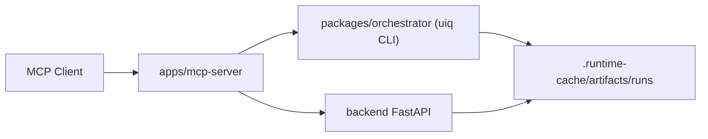

# MCP Server

`apps/mcp-server` exposes this repository's automation, reporting, and register orchestration flows as MCP tools for external AI clients.

## When to Use It

- You want an MCP client to inspect runs, launch `uiq` workflows, or orchestrate register flows without shelling into the repo directly.
- You need a stable tool surface on top of the backend API, orchestrator CLI, and local run artifacts.
- You want a local AI agent to self-check the workspace, gather evidence bundles, and operate on recent runs.

## Core Commands

```bash
pnpm mcp:start
pnpm mcp:check
pnpm mcp:test
pnpm test:mcp-server:real
```

## Architecture



## Local Prerequisites

- Install workspace dependencies with `pnpm install`.
- Start the backend if you want live API-backed MCP behavior.
- Keep the repo root available because run tools resolve `configs/profiles/`, `configs/targets/`, and `.runtime-cache/artifacts/runs/` from the workspace.

## Environment Variables

- `UIQ_MCP_API_BASE_URL`: backend base URL for live API requests.
- `UIQ_MCP_WORKSPACE_ROOT`: override the workspace root if the MCP server should point at a different checkout.
- `UIQ_MCP_DEV_RUNTIME_ROOT`: override the local MCP runtime cache root for test harnesses.
- `UIQ_MCP_TOOL_GROUPS`: optional comma-separated advanced tool groups (`advanced,register,proof,analysis` or `all`).
- `UIQ_MCP_FAKE_UIQ_BIN`: test-only override for `pnpm uiq` execution in MCP tests.
- `UIQ_ENABLE_REAL_BACKEND_TESTS`: enables `pnpm test:mcp-server:real` against a real backend instead of skipping the suite.

## Real vs Stubbed Test Boundaries

- Stubbed / contract-focused:
  - `pnpm mcp:test`
  - `pnpm mcp:smoke`
  - Uses fixtures and stub backend helpers for deterministic regression coverage.
- Real backend:
  - `pnpm test:mcp-server:real`
  - Requires `UIQ_ENABLE_REAL_BACKEND_TESTS=true` and a reachable backend runtime.
  - Validates the real `sessions -> flows -> runs` path instead of the stubbed contract layer.
